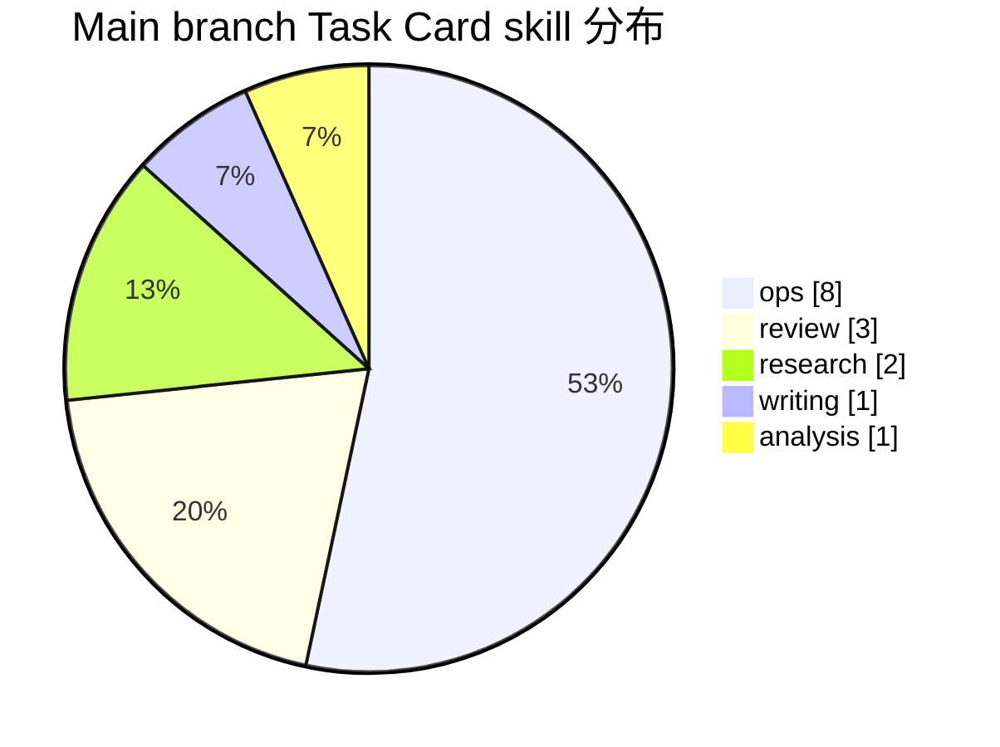
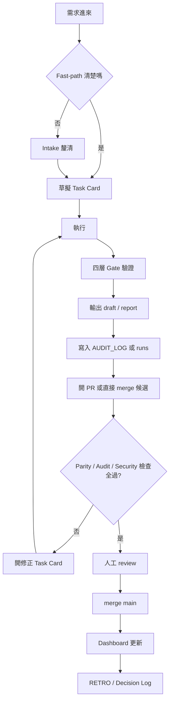
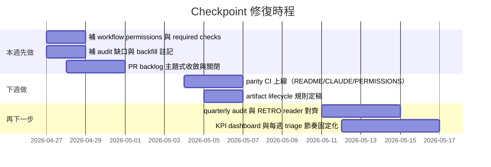

# Checkpoint 對話與專案分析報告

## 執行摘要

結論先講：這個倉庫的核心價值已經做出來了，但目前不是「能力不夠」，而是「收斂不夠」。如果用一句話總結：**agent-harness 已經具備一人公司可用的控制平面雛形，主線任務成功率高、治理結構完整；但文件漂移、稽核缺口、PR 爆量與重複分支，正在把原本的可控性侵蝕掉。** 以目前 main branch 來看，它適合一人公司繼續用，但**不適合再無限制擴張**；下一步應優先做收斂與合併治理，而不是再加新功能。fileciteturn32file0 fileciteturn32file1 fileciteturn25file2 fileciteturn35file1

從已合併主線來看，main 上可辨識的正式 Task Card 共 15 張，全部標記為 done；其中 ops 佔比最高，代表專案重心已從「做內容」轉成「補治理、補驗證、補流程護欄」。這是正向訊號，因為它表示框架不是停在概念，而是進入自我修補階段。另一方面，main 的 audit log 只覆蓋到 13 張卡，少了 `20260409-001` 與 `20260415-A01` 兩張已完成任務；也就是說，**任務完成率 100%，但稽核完整率只有 86.7%**。對一人公司來說，這不是小問題，因為你的成本分析、retro 與後續決策都仰賴這條審計鏈。fileciteturn14file0 fileciteturn22file2 fileciteturn23file0

正向面，這個 repo 有三個高價值能力已經落地。第一，Analysis skill 已被正式定義成獨立 skill，而不是夾在 research / writing 之間的灰色地帶；第二，PR #49 把 validator consolidation、governance docs restructure、engineering guardrails 一次收斂，甚至能在 Codex 指出 CJK token 低估後，數分鐘內修正估算方式並補測試；第三，Decision D006 把 execution log 從「全部都記」收斂成「只有 failed / partial / high-risk / 多 checkpoint 任務才記」，這是很典型、也很適合一人公司的降儀式成本決策。fileciteturn33file0 fileciteturn33file1 fileciteturn24file0 fileciteturn24file1 fileciteturn20file2 fileciteturn21file1

反向面，現在最大的風險不是單一 bug，而是**多個真相同時存在**。README 仍把 `skill_type` 寫成只有 research / writing / ops / review，CLAUDE.md 仍把 create_task_card 視為 ask，active project context 仍停在 2026-04-15、只提到 6 筆 audit log；但實際 policy、routing、permissions 與 task reality 都已改變。也就是說，規則檔、啟動檔、說明檔與專案 context 已經不同步。再加上近期 PR #23–#52 這一段裡，只有 3 個 merged、27 個還開著，而且至少有一大半是同題反覆開枝，例如 validator tooling、analysis skill 文件、workflow permissions 修補、五主題測試等，這會讓 repo 從「可審核」逐步退化成「可懷疑、但不易定案」。fileciteturn32file0 fileciteturn32file1 fileciteturn25file2 fileciteturn34file1 fileciteturn27file0 fileciteturn24file2 fileciteturn29file0 fileciteturn28file2

對一人公司來說，最重要的判斷不是「這套東西能不能做更多」，而是「這套東西還能不能讓你更省腦」。現在答案是：**可以，但前提是先做三件事：收斂文件真相、補齊 audit 完整性、把 PR backlog 壓回可治理範圍。** 如果這三件事不先做，後面不管是 v3 specialists、更多 skill、還是更精準 cost telemetry，都只會把維護成本抬高。這個判斷也符合專案自己在 D003 裡的原則：沒有實際觸發條件，不要過早升級架構。fileciteturn35file1

### 已知事實

main branch 的結構定位是「一人公司 Decision Control Plane」，包含三平面十六模組；analysis skill、failure taxonomy、approval policy、execution log schema 等都已在 repo 中有正式檔案。main 上可見 15 張正式 Task Card、2 個 project context（1 active、1 archived），以及一個已收斂的 v2 governance 系統。fileciteturn32file0 fileciteturn33file0 fileciteturn33file1 fileciteturn34file1 fileciteturn34file2

### 合理推論

這個 repo 的主線實際上已經從「建立框架」進入「治理框架自身」階段；也就是說，成熟度不是卡在 lack of features，而是卡在 documentation parity、audit continuity、PR triage discipline。這個階段若做得好，會非常適合一人公司；做不好，就會掉進「規則越多、越難信任」的反效果。fileciteturn24file0 fileciteturn20file2 fileciteturn21file1

### 待驗證資訊

部分早期任務指向的 `outputs/drafts/*` 檔案，在目前可存取的 main branch 中無法直接開啟驗證；因此我只能確定 task card 與 audit log 有指向這些輸出，不能把「該輸出檔必定存在於當前 main」當成既定事實。另，PR 內的「CI 全綠」多半來自 PR body 或任務摘要的自述，而非 connector 直接回傳的 workflow run logs。fileciteturn14file0 fileciteturn24file0 fileciteturn29file0

### 高風險假設

若 repo owner 把大量 open PR 當成「沙盒草稿區」，那麼 open PR 爆量的風險會比我這份報告判斷的低；但如果這些 PR 被視為真 backlog，則目前的合併治理已偏高風險。這一點需要用你的實際操作習慣去校正。另，若未來你真的開始把 outputs/reports/ 對外交付，文件漂移與 audit 缺口的風險會比現在大得多。fileciteturn29file0 fileciteturn28file2

## 範圍與方法

本次研究先按你的要求，從已啟用 connector 開始確認可用來源；本環境可用外部連接器中，實際已啟用且與本題直接相關者為 GitHub。之後以指定 repo `changchiwulab-cmyk/agent-harness` 為主資料源，優先讀取 main branch 的 README、CLAUDE、system policies、memory contexts、task cards、audit / run / error logs、decision logs、reports 與 selected PR threads；若 repo 內沒有完整對話紀錄，則將「對話」代理為三種可審核載體：**Task Card 執行紀錄、Decision Log、PR / review thread**。這個方法是因為 repo 並沒有提供逐輪 chat transcript，但有足夠多的結構化替代物件可重建工作流。fileciteturn32file0 fileciteturn32file1 fileciteturn14file0 fileciteturn34file0

我實際檢視的 repo 類別包括：系統規則 (`system/*`)、任務模板與正式 task cards (`tasks/*`)、skills 與評測範例 (`skills/*`)、記憶體與專案上下文 (`memory/*`)、稽核 / 執行 / 錯誤日誌 (`logs/*`)、輸出草稿與正式報告 (`outputs/*`)，以及 PR #23–#52 的近期 thread 集合。關鍵檔案包含 `README.md`、`CLAUDE.md`、`system/PERMISSIONS.yaml`、`system/ROUTING_RULES.md`、`system/EXECUTION_LOG_SCHEMA.yaml`、`system/GATE_POLICY.yaml`、`system/COST_POLICY.md`、`logs/AUDIT_LOG.md`、`logs/runs/20260409-001_system-validation.yaml`、`logs/errors/2026-04-04_20260404-S01_error.md`、`memory/active_projects/agent-harness/context.md`、`memory/archived_projects/vietnam-expansion/context.md`、以及多份 decision logs 與 task cards。fileciteturn32file0 fileciteturn32file1 fileciteturn25file2 fileciteturn33file0 fileciteturn21file1 fileciteturn21file2 fileciteturn25file0 fileciteturn14file0 fileciteturn22file1 fileciteturn22file0 fileciteturn34file1 fileciteturn34file2

量化部分，我把 main branch 上可辨識的正式 Task Card 當成母體；PR 部分則採兩層做法：一層看 PR #23–#52 的總體 backlog / 重複度，一層抽樣分析有實際 review comment 的 thread（PR #42、#49、#51），量測 comment resolution 與首回覆速度。情緒分數不是用外部情緒模型跑，而是**用任務狀態、DoD 完成度、評論語氣與是否已處理**做啟發式轉分，因此會以「合理推論」而非硬事實呈現。fileciteturn22file2 fileciteturn23file0 fileciteturn27file0 fileciteturn27file1 fileciteturn24file0 fileciteturn25file0 fileciteturn26file0

外部補充資料只用在建議層，不用來覆蓋 repo 事實。補充來源選擇的是官方 GitHub Docs：一是 GitHub Actions workflow `permissions` 的 least privilege 寫法；二是 protected branches 的 required checks / reviews；三是 code scanning alerts 的狀態與配置概念。理由很單純：目前 repo 的一部分風險正好卡在 workflow permissions 與 PR gate，而這兩件事必須以官方規格為準。citeturn6search2turn6search1turn6search0

## 資料集盤點

### 主線 Task Card 與專案資產

下表以 **main branch 可見資料** 為主，將 Task Card 視為「對話／工作單元」，project context 視為「專案單元」。參與者欄若檔案未明示，標為「推定」。來源主要來自 task cards、audit log、execution log 與 project context。fileciteturn14file0 fileciteturn22file2 fileciteturn23file0 fileciteturn23file1 fileciteturn27file0 fileciteturn27file1 fileciteturn24file0 fileciteturn34file1 fileciteturn34file2

| ID / 名稱 | 日期區間 | 參與者 | 類型 | 狀態 | 規模 | 關鍵文件 | 標籤 | Repo 位置 |
|---|---|---|---|---|---|---|---|---|
| 20260404-R01 tools-inventory-research | 2026-04-04 | 使用者＋Claude Code（推定） | chat/task | done | ~18K token | 指向 `solo-company-tools-inventory.md` | research、business | `tasks/2026-04-04_tools-inventory-research.yaml` |
| 20260404-R02 tools-inventory-review | 2026-04-04 | 同上 | chat/task | done | ~12K | tools inventory 檢查 | review、business | `tasks/2026-04-04_tools-inventory-review.yaml` |
| 20260404-O01 tools-inventory-fix | 2026-04-04 | 同上 | chat/task | done | ~10K | tools inventory 修補 | ops、business | `tasks/2026-04-04_tools-inventory-fix.yaml` |
| 20260404-S01 solo-business-strategy | 2026-04-04 | 同上 | chat/task | done | ~25K | 指向 `ai-era-solo-business-strategy.md` | research、strategy | `tasks/2026-04-04_ai-era-solo-business-strategy.yaml` |
| 20260404-W01 solo-business-proposal | 2026-04-04 | 同上 | chat/task | done | ~20K | 指向 proposal draft | writing、proposal | `tasks/2026-04-04_ai-era-solo-business-proposal.yaml` |
| 20260404-RV01 proposal-review | 2026-04-04 | 同上 | chat/task | done | ~18K | proposal review | review、proposal | `tasks/2026-04-04_ai-era-solo-business-proposal-review.yaml` |
| 20260404-O02 proposal-fix-v2 | 2026-04-04 | 同上 | chat/task | done | ~15K | proposal v2 修補 | ops、proposal | `tasks/2026-04-04_proposal-fix-v2.yaml` |
| 20260409-001 system-validation | 2026-04-09 | 使用者＋Claude Code（推定） | chat/task | done | 3 checkpoints、9 file reads | execution log | review、system | `tasks/2026-04-09_system-validation.yaml` |
| 20260415-A01 create-task-card-permission-analysis | 2026-04-15 | 使用者＋Claude Code（推定） | chat/task | done | analysis 首次實戰 | `analysis-create-task-card-permission.md` | analysis、permissions | `tasks/2026-04-15_create-task-card-permission-analysis.yaml` |
| 20260417-O01 evidence-gap-filling | 2026-04-17 | 同上 | chat/task | done | ~12K | error log、D005、token calibration draft | ops、evidence | `tasks/2026-04-17_evidence-gap-filling.yaml` |
| 20260417-O02 retro-graduation-and-archive | 2026-04-17 | 同上 | chat/task | done | ~15K | `retro-2026-Q2-01.md`、archived project | ops、report、archive | `tasks/2026-04-17_retro-graduation-and-archive.yaml` |
| 20260417-O03 system-rule-tuning | 2026-04-17 | 同上 | chat/task | done | ~10K | `COST_POLICY.md`、deprecated weekly review | ops、cost、cleanup | `tasks/2026-04-17_system-rule-tuning.yaml` |
| 20260424-O01 cleanup-validator-consolidation | 2026-04-24 | 同上 | chat/task | done | 10 tool calls | validator consolidation | ops、CI、cleanup | `tasks/2026-04-24_cleanup-validator-consolidation.yaml` |
| 20260424-O02 governance-docs-restructure | 2026-04-24 | 同上 | chat/task | done | 12 tool calls | token-calibration report、INTAKE rewrite | ops、docs、governance | `tasks/2026-04-24_governance-docs-restructure.yaml` |
| 20260424-O03 engineering-guardrails | 2026-04-24 | 同上 | chat/task | done | 14 tool calls | context budget CI、D006 | ops、guardrail、cost | `tasks/2026-04-24_engineering-guardrails.yaml` |
| agent-harness | 持續中 | 使用者 | project | active | 16 modules、至少 6 decisions | active project context、decision logs | core、governance | `memory/active_projects/agent-harness/context.md` |
| vietnam-expansion | 2026-04-17 封存 | 使用者 | project | archived | 1 context、可 git mv 還原 | archived context | research、archived | `memory/archived_projects/vietnam-expansion/context.md` |

### PR / issue thread 盤點

下表把 PR #23–#52 依「主題相近、對同一問題空間重複修改」分群。這樣做的原因是近期 open PR 有明顯重疊；若一筆一筆列，資訊量會很大，但判斷價值反而下降。來源來自近期 PR metadata 與部分實際 review threads。fileciteturn24file2 fileciteturn27file0 fileciteturn27file1 fileciteturn27file2 fileciteturn28file0 fileciteturn28file1 fileciteturn28file2 fileciteturn29file0 fileciteturn29file1 fileciteturn29file2

| PR 群組 | 日期區間 | 參與者 | 類型 | 狀態 | 規模 | 關鍵內容 | 風險判讀 |
|---|---|---|---|---|---|---|---|
| #25 | 2026-04-15 | repo owner / Claude | issue/PR | merged | 5 commits | analysis skill 註冊、CI 一致化、例子修補 | 正向基礎建設 |
| #26 | 2026-04-17 | repo owner / Claude | issue/PR | merged | 3 commits | v2 optimization：補空白、retro 晉升、成本校準 | 正向治理收斂 |
| #49 | 2026-04-24 | repo owner / Claude / Codex bot | issue/PR | merged | 5 commits | validator consolidation、docs restructure、guardrails | 正向快速迭代 |
| #42 | 2026-04-22 | repo owner / Claude / Codex bot | issue/PR | open | 30 commits | 實跑四卡＋合併六分支；含 unresolved review | 高風險整合分支 |
| #51 | 2026-04-26 | repo owner / Claude / Codex bot | issue/PR | open | 6 commits | 最新五卡、十建議全面優化 | 高價值但尚未合併 |
| #29 / #30 / #52 | 2026-04-18～04-26 | repo owner / Copilot Autofix | issue/PR | open | 1 commit / PR | workflow `permissions` least privilege 修補 | 安全衛生未收斂 |
| #43 / #44 / #45 | 2026-04-22 | repo owner / Codex | issue/PR | open | 1～8 commits | validator tooling、dev deps、unit tests 重複提案 | 重複工作訊號 |
| #46 / #47 / #48 | 2026-04-24 | repo owner / Codex | issue/PR | open | 3～5 commits | `analysis` skill 文件 / template 更新重複提案 | 重複工作訊號 |
| #34 / #35 | 2026-04-21 | repo owner / Claude | issue/PR | open | 2～10 commits | 五主題測試重複版本 | 收斂不足 |
| #23 / #24 | 2026-04-14 | repo owner / Claude | issue/PR | open | 6～9 commits | 高層分析草稿（Elon / Jobs style） | 歷史分析資產，未正式收斂 |
| #27 / #28 | 2026-04-17 | repo owner / Claude | issue/PR | open | 4～7 commits | 回應 review、回補 audit、修 stale review 狀態 | 對主線有價值，未合併可惜 |
| #32 / #33 | 2026-04-20 | repo owner / Claude | issue/PR | open | 4～13 commits | Opus 4.7 相容與 governance loops | 中高價值延伸分支 |
| #50 | 2026-04-24 | repo owner / Claude | issue/PR | open | 1 commit | 三個 industry-specific test cards | 中價值測試資料 |

我對這張表的判讀是：**PR 不是不足，而是太多。** 它們目前不再只承載 code review，而是承載「暫存策展、沙盒驗證、未合併 roadmap、重複生成提案」四種角色。這本身不是錯，但若沒有 merge/close discipline，PR 會從協作工具變成知識分叉來源。對一人公司來說，這種情況最終會直接變成認知成本。fileciteturn27file0 fileciteturn27file2 fileciteturn28file0 fileciteturn28file1 fileciteturn28file2 fileciteturn29file0

## 量化觀察

### 核心指標表

下表分成三種證據等級：**高信心**（main 檔案可直接驗證）、**中信心**（PR / review thread 可驗證，但未必已合併）、**推論**（依文字情緒與狀態啟發式計算）。fileciteturn14file0 fileciteturn22file2 fileciteturn23file0 fileciteturn27file0 fileciteturn27file1 fileciteturn24file0 fileciteturn25file0 fileciteturn26file0

| 指標 | 數值 | 解讀 | 信心 |
|---|---:|---|---|
| main 可辨識正式 Task Card | 15 | 主線任務量已足夠做第一輪治理觀察 | 高 |
| main 任務完成率 | 15 / 15 = 100% | 交付成功率高 | 高 |
| main 失敗率 | 0 / 15 = 0% | 主線沒有 failed task | 高 |
| main 可見 partial 率 | 0 / 15 = 0% | partial 主要出現在開放分支，不在主線 | 高 |
| audit 完整率 | 13 / 15 = 86.7% | 兩張已完成卡未進 main audit | 高 |
| detailed execution log 覆蓋率 | 1 / 15 = 6.7% | 舊設計落地率低，後續已用 D006 收斂用途 | 高 |
| visible error log 覆蓋率 | 1 / 15 = 6.7% | 有錯誤樣本，但屬歷史重建範例 | 高 |
| 已知任務平均 token 估計 | 約 14.9K | 成本級距可用，但還是粗估 | 高 |
| skill 分布 | ops 53.3%、review 20%、research 13.3%、writing 6.7%、analysis 6.7% | 治理優化已成主軸 | 高 |
| sampled review comment 解決率 | 3 / 4 = 75% | 有能力快速修，但不是每條都收斂到主線 | 中 |
| sampled 首回覆中位數 | 約 2 分 23 秒 | review 互動速度非常快 | 中 |
| inspected PR 範圍 | PR #23–#52，共 30 筆 | backlog 規模偏大 | 高 |
| 其中 open / merged | 27 open / 3 merged | 近段期間合併率偏低 | 高 |
| open PR 主題重疊比 | 至少 17 / 27 ≈ 63% | 明顯有重複分支與提案 | 中 |
| context budget 使用率 | 1,197 / 3,000 ≈ 39.9% | 目前不構成 v3 觸發 | 高 |
| 任務情緒分數 | +0.77 / 1（啟發式） | 主線任務整體偏正向 | 推論 |
| PR thread 情緒分數 | +0.25 / 1（啟發式） | backlog 的摩擦明顯高於主線任務 | 推論 |

### 技能分布圖

### 指標判讀

這批數字的關鍵，不是 100% 完成率，而是**完成率高、收斂率低**。你已經證明這套框架可以完成事情，但還沒有證明它能把所有真相穩定收回單一主線。主線 audit 缺 2 筆、README / CLAUDE / active project context 明顯過時、近期 merged 只有 3 個而 open 27 個，這些都在說同一件事：**執行成功，不等於治理成功。** fileciteturn32file0 fileciteturn32file1 fileciteturn34file1 fileciteturn29file1

另外，D003 對 v3 升級的克制是正確的。就目前資料看，context budget 大約 40%，還遠低於 90% 警戒；唯一已知失敗事件是 2026-04-04 的 web search rate limit，且未阻斷任務；也没有看到 main 上同類錯誤連續重複三次的跡象。因此現在最值得投資的，不是 specialist architecture，而是**把 v2 的真相鏈穩住**。fileciteturn24file1 fileciteturn35file1 fileciteturn22file0

## 正向與反向分析

### 正向案例

**案例一是 PR #49 的工程護欄迭代。** 這個案例很代表「好的代理治理」長什麼樣：先有 Task Card `20260424-O03`，明確定義 context budget CI 與 execution log scope 決策；再有 PR #49 收斂並合併；review 階段 Codex 指出 CJK token 會被 `char/4` 嚴重低估，接著 owner 在同一個 thread 內直接確認、修正、補測試，並把估值從 554 改到 1,197。這裡真正有價值的不是 bug fix 本身，而是**檢查、被指出、快速修、留下可追溯文字與決策**這整條閉環已成立。fileciteturn24file0 fileciteturn24file1 fileciteturn20file2 fileciteturn21file1

**案例二是 Analysis skill 從灰區變正式能力。** PR #25 把 analysis skill 正式註冊到 validators、docs 和 context；`skills/analysis/SKILL.md` 與 `eval_examples.md` 也已完整落地，`ROUTING_RULES.md` 明確定義 research 回答「事實是什麼」、analysis 回答「該怎麼選」。之後 `20260415-A01` 又拿 create_task_card 權限調整做第一個真實 analysis 任務，並用六維評估、一人公司適配度、高風險假設等框架做出建議，最後寫入 D004 做制度性承接。這代表 analysis 不是「多加一個 label」，而是已經變成可複用的推理模板。fileciteturn29file2 fileciteturn33file0 fileciteturn33file1 fileciteturn33file2 fileciteturn23file0 fileciteturn23file1 fileciteturn23file2

**案例三是 D006 的「少做一點，但做對」。** `EXECUTION_LOG_SCHEMA.yaml` 一開始設得很完整，但實際只有一筆 `runs/` 落地；D006 沒有硬推全員照單執行，而是回到 evidence：近 5 筆 happy-path 任務都沒有 failed / partial，且 AUDIT_LOG 已能支撐大部分審計需求，因此決定只在 failed / partial / high-risk / 多 checkpoint 任務才要求 detailed execution log。這是很成熟的治理思路，因為它不是為了看起來完整而加制度，而是根據採用率與收益去做 scope narrowing。對一人公司，這種取捨非常對。fileciteturn20file2 fileciteturn21file1 fileciteturn24file0 fileciteturn24file1

### 反向案例

**反向一：文件真相分裂。** 主線最嚴重的不是 code bug，而是三種入口文件在講不同世界。README 快速上手還寫 `skill_type` 只有四種，沒把 analysis 列進去；CLAUDE.md 仍把 create_task_card 放在 ask；但 `PERMISSIONS.yaml` 已明確把 create_task_card 升為 allow，`ROUTING_RULES.md` 也已把 analysis 視為正式 skill，active project context 仍停在 2026-04-15、只認列 6 筆 audit log。這種 drift 一旦持續，操作者就會不知道該信哪份文件，最後制度就形同不存在。根因是：**文件沒有同一個 source of truth，也沒有針對「文件與政策一致性」做 merge gate。** 風險分級：高。優先序：最高。fileciteturn32file0 fileciteturn32file1 fileciteturn25file2 fileciteturn33file0 fileciteturn34file1

**反向二：audit 鏈不完整。** `20260409-001` 與 `20260415-A01` 都是已完成任務，前者甚至有完整 execution log，後者也有完整 analysis output 與 D004；但 main 的 `logs/AUDIT_LOG.md` 沒把它們記進去。之後 PR #28 才嘗試回補這兩筆。這表示目前 audit 写入不是實務上的硬門檻，而比較像「通常會做」。對審計系統而言，這是很大的結構性缺口，因為只要少兩筆，cost calibration、retro sample、失敗率統計都會偏掉。根因是：**audit log 沒有跟 done 狀態綁死，回補靠人想起來。** 風險分級：高。優先序：最高。fileciteturn14file0 fileciteturn22file1 fileciteturn22file2 fileciteturn23file0 fileciteturn29file1

**反向三：PR sprawl 與重複提案已經構成治理負債。** 近期 open PR 中，至少有三組明顯重複：一組是 validator tooling（#43/#44/#45），一組是 analysis skill 文件 / template（#46/#47/#48），一組是 workflow permissions 安全修補（#29/#30/#52），再加上五主題測試雙版本（#34/#35）。這類情況對團隊大公司都已經麻煩，對一人公司更傷，因為同一個人同時是作者、審查者、合併者、使用者。你的腦袋會被迫記住太多「尚未定案但看起來都合理」的版本。根因是：**PR 被當成草稿容器，但沒有 close / supersede 規則。** 風險分級：高。優先序：高。fileciteturn27file0 fileciteturn24file2 fileciteturn27file1 fileciteturn27file2 fileciteturn28file0 fileciteturn28file1 fileciteturn28file2

**反向四：安全與 CI 衛生還沒關門。** open 的 security autofix PR #29、#30、#52 都在做同一類事：替 read-only workflow 補上顯式 `permissions`。而 GitHub 官方文件明確說明，workflow 可在頂層或 job 層設定 `permissions`，一旦指定權限，未指定的 scopes 會被視為 `none`；對純 checkout 與 read-only checks，`contents: read` 是標準最小權限寫法。若這件事一直留在 open PR 而不收斂，代表 repo 的安全建議還停在「知道」，沒進到「定稿」。風險分級：中高。優先序：高。fileciteturn28file2 fileciteturn28file1 fileciteturn29file0 citeturn6search2turn6search0

**反向五：review feedback 能修，但不一定回主線。** PR #42 的 Codex 留下 P2：`load_permissions_registry` 對 malformed `PERMISSIONS.yaml` 的處理不夠優雅，可能讓 CI 直接噴 `Psych::SyntaxError` 而非回傳結構化錯誤。這類建議很務實，也不是吹毛求疵；問題是它還留在 open thread，沒有回到 merged main。相較之下，PR #49、#51 的 comment 都有快速回覆與修正。這代表團隊（其實就是你 + automation）已經有修問題能力，但**沒有統一的「修到哪裡才算收斂」規則**。風險分級：中。優先序：中高。fileciteturn25file0 fileciteturn24file0 fileciteturn26file0

### 風險分類與優先順序

| 問題 | 根因 | 風險 | 優先順序 |
|---|---|---|---|
| 文件 / 規則 / context 漂移 | 無單一真相與合併 gate | 高 | P0 |
| audit 缺兩筆已完成任務 | done 不等於 audit 完整 | 高 | P0 |
| PR 重複與爆量 | 無 supersede / merge discipline | 高 | P0 |
| workflow permissions 未收斂 | 安全建議留在 open PR | 中高 | P1 |
| review 回饋留在分支 | 無「修完必回主線」規則 | 中 | P1 |
| 早期輸出資產不可見 | artifact lifecycle 不一致 | 中 | P2 |

## 改進方案與監控設計

### 可執行改進清單

下表按「短期先收斂、長期再系統化」排序。重點不是做更多，而是**先讓 main 成為唯一可信版本**。

| 項目 | 時程 | 一人公司適配 | 預估投入 | 預估影響 | 建議 |
|---|---|---:|---:|---:|---|
| 建立 docs / policy parity gate | 短期 | 高 | 0.5–1 天 | 很高 | 新增一支 CI，檢查 README / CLAUDE / PERMISSIONS / ROUTING / TEMPLATE 關鍵列是否一致 |
| 把 audit completeness 綁進 merge gate | 短期 | 高 | 0.5 天 | 很高 | `status=done` 的 task 必須有 audit entry；否則 CI fail |
| 一次性清理 PR backlog | 短期 | 高 | 1–2 天 | 很高 | 以主題合併：只保留每個主題 1 條 active PR，其餘 close with superseded note |
| 合併 workflow `permissions` 修補 | 短期 | 高 | 0.5 天 | 高 | 把 read-only workflow 一律加 `permissions: contents: read` |
| 啟用 required status checks + PR review | 短期 | 中高 | 0.5 天 | 高 | main 至少要求 spec-consistency 與人工 review 後才能 merge |
| 補齊缺漏 audit entries | 短期 | 高 | 0.5 天 | 高 | 先回補 `20260409-001`、`20260415-A01`，並在 changelog 註明 backfill |
| 將 quarterly audit index 化正式落地 | 中期 | 中 | 1 天 | 中高 | 只有在 retro 與 downstream readers 全改完後才切換 |
| 建立 artifact lifecycle | 中期 | 高 | 1 天 | 中 | 明定 draft / report / archived 的保留規則，避免早期輸出失聯 |
| Token precision 升級真 tokenizer | 長期 | 中 | 1–2 天 | 中 | 只有當 context usage >70% 或模型切換頻繁才值得做 |
| PR triage dashboard | 長期 | 高 | 1 天 | 中高 | 每週看 open/duplicate/stale PR，不靠記憶管理 |

我給你的決策順序很直接：

第一優先，不是修更多內容，而是**讓 main 重新值得相信**。  
第二優先，才是讓 branch / PR 成為有效沙盒，不是長期平行宇宙。  
第三優先，才是更細的成本與路由優化。

這個順序很符合一人公司：先把認知成本壓下來，效率自然回來；反過來做，只會讓流程越來越「完整」，但越來越難用。fileciteturn25file2 fileciteturn35file1

### 建議 KPI 與 dashboard

| KPI | 定義 | 目標 | 警戒值 | 資料來源 |
|---|---|---:|---:|---|
| Audit completeness | `done task / audited task` 對齊率 | 100% | <95% | task cards + `logs/AUDIT_LOG*` |
| Docs drift count | README / CLAUDE / TEMPLATE / PERMISSIONS 不一致項數 | 0 | ≥1 | parity CI |
| Open PR overlap ratio | 重複主題 open PR / 全部 open PR | <20% | >35% | PR inventory |
| PR median first reply | actionable review comment 首回覆時間 | <4 小時 | >24 小時 | PR comments |
| Review resolution rate | actionable review comment 已處理比例 | >90% | <70% | PR comments |
| Workflow least-privilege coverage | 顯式 `permissions` 的 workflow 比例 | 100% | <100% | `.github/workflows/*` |
| Artifact discoverability | task output path 可直接在 repo 開啟比例 | >95% | <85% | task cards + repo paths |
| Context budget utilization | `CLAUDE.md + GLOBAL_RULES.md` / 3,000 | <70% | >90% | context budget check |
| Failure recurrence | 4 週內同一 taxonomy id 次數 | <3 | ≥3 | errors + audit |
| Role drift / stale context | active project context 與最新 status 差異天數 | <7 天 | >14 天 | `memory/active_projects/*` |

### 建議 workflow

### 修復時程

### 與官方做法的對齊建議

GitHub 官方文件明確支持在 workflow 根層或 job 層設定 `permissions`，而且指定任何權限後，其他未指定權限會被設成 `none`；對只做 checkout 與本地檢查的 workflow，`contents: read` 就足夠。這正好對應你目前 open 的 security autofix PR。另，GitHub 的 protected branches 可以要求 status checks 與 PR review，這非常適合拿來把 `spec-consistency`、parity check、audit completeness 變成 main merge 前的硬門檻。至於 code scanning alerts，GitHub 也提醒同一 alert 可能來自不同 configuration，舊配置若不清理，alert 狀態可能會殘留；這正好說明為什麼 workflow 修補不能只停在 open PR，要真的收斂到主線與現行配置。citeturn6search2turn6search1turn6search0turn6search5

## 開放問題與限制

這份報告有三個限制，我直接講清楚。

第一，repo 裡沒有完整逐輪聊天 transcript，所以我把「所有對話」定義為 Task Card、Decision Log 與 PR/review thread 這三類可審核物件；如果你口中的 Checkpoint 指的是外部聊天平台的原始對話，這個 repo 本身並沒有完整保存。fileciteturn21file0 fileciteturn34file0

第二，部分早期任務的輸出檔雖然在 task card 或 audit log 被指到，但在當前 main branch 上無法直接打開驗證，我因此不把這些輸出視為已確認存在，只把它們列為「被引用的預期 artifact」。這代表早期鏈路的可重播性，保守看待比較安全。fileciteturn14file0

第三，近期很多改善其實已經出現在 open PR，尤其是 PR #51；因此如果你問的是「最新分支狀態」，答案會比 main 進步很多；但如果你問的是「目前可信主線狀態」，我必須依 main 與已合併 PR 來下主要判斷。這也是我為什麼把這份報告的主結論定在：**不要先加功能，先做收斂。** fileciteturn29file0 fileciteturn24file0 fileciteturn29file2